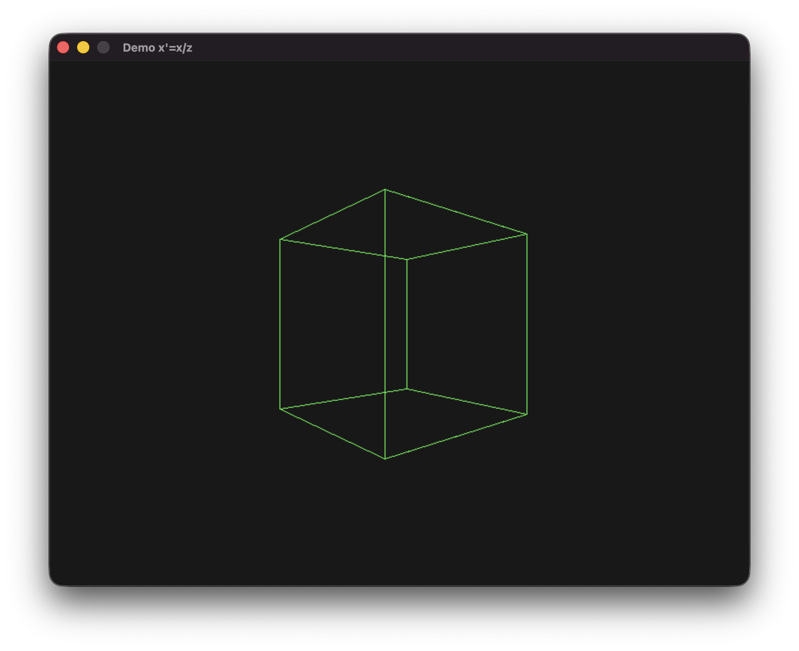

# 3D Projection Demo

## References
  * [One Formula That Demystifies 3D Graphics](https://www.youtube.com/watch?v=qjWkNZ0SXfo)
  * [Donut math: how donut.c works](https://www.a1k0n.net/2011/07/20/donut-math.html)
